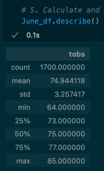
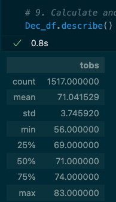
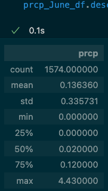
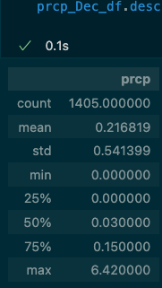

# Surfs_Up_Challenge
Tools: Jupyter Notebook, VS Code

## Overview of the Statistical Analysis:
The purpose of this module was to extract information about the precipitation and temperatures from the last 12 months using SQLAlchemy. We used August 23, 2017 as our reference point and subtracted 365 days using the datetime dependency. Once we were able to extract this data, we needed to target the months of June and December over the years to determine if the surf and ice cream shop business is sustainable year-round.

## Results
 

- When juxtaposing the June and December statistics, we can already see there is more data gathered for June than for December; a difference of 183 datapoints (1700 - 1517). 
- Since there is more data from June than from December, this affects the statistics given. We can especially see the affect on the average and minimum stats with an average temperature of 74.94 (June) and of 71.04 (Dec) and a minimum of 64 (June) and 56 (Dec). The max temperature was slightly affected with a two degree difference: 85 (June) and 83 (Dec).
- If we compare the quartiles between June and December, there is approximately a 3-4 degree difference between them: 25% (73 (June), 69 (December)), 50% (75 (June), 71 (December)), and 75% (77 (June), 74 (December)).

## Summary
If we review the results presented above, we can assume that June seems to be ideal tempearture-wise for business especially with the mean temperature being approximately 75 degrees. One reason for there being more datapoints in June than in December is possibly null values in the December data; may on some days in December, the shop was closed because of it being the slow season for such a shop. This can be backed by the fact the minimum temperature in December hit a low of 56, which for consumers may be too cold to be either surfing or eating ice cream or both. 

Also, if we look at the quartiles for June, specifically the 75% quartile, the majority of temperature datapoints stayed at or below a temperature of 77. According to different websites, it seems the ideal temperature for surfing is in the 70s and it becomes too cold when it reaches between 50-60. If we also look at the precipitation statistics for both months (pictured below), there is approximately a difference of 2 in the maxes (4.43 (June), 6.42 (December)). Although there are fewer datapoints for December, it appears that there was more precipitation in December making it more difficult to keep the shop open. From this data, it does not seem completely ideal for the shop to run year-round.

 
